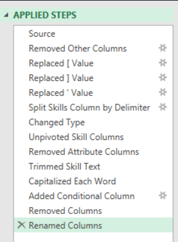
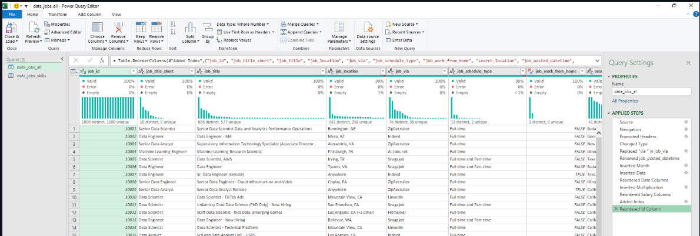
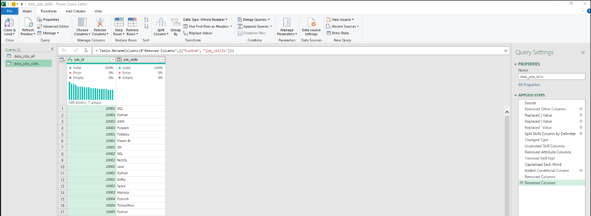
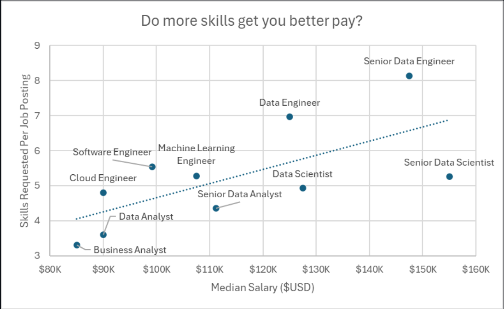
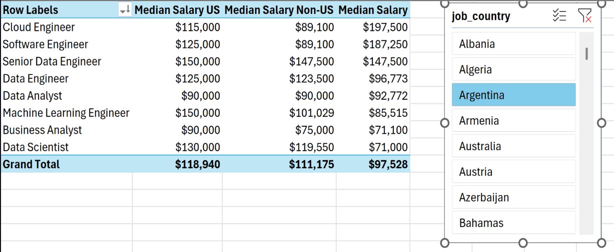
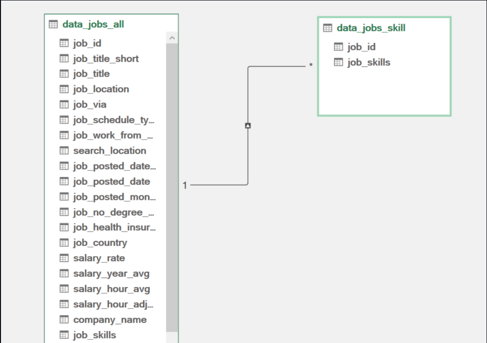
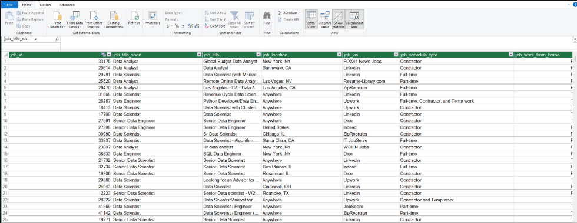
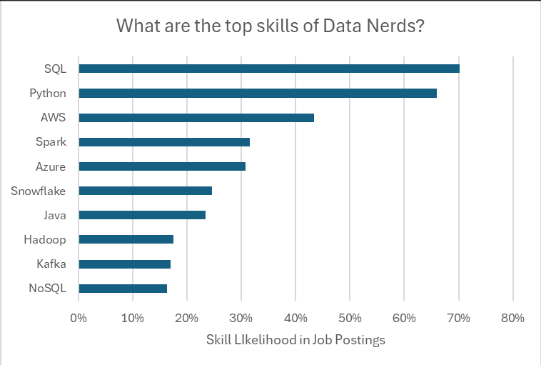
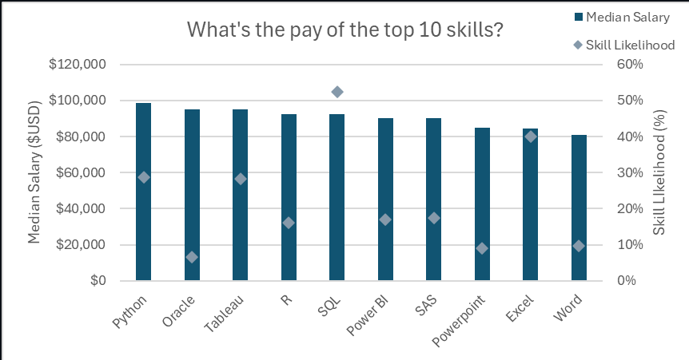

# Data Job Market Analysis using Excel

An Excel-based data analytics project that explores salary trends, regional differences, in-demand skills, and the relationship between technical skills and compensation in the data job market.

---

## About the Project

As a job seeker preparing for a career in data analytics and AI, I wanted to understand what employers actually look for in data professionals and which skills are associated with better career opportunities.

Instead of relying on assumptions, I analyzed real-world data job postings from 2023 to explore salary trends, regional differences, skill demand, and the relationship between the number of skills required and compensation.

This project demonstrates an end-to-end data analytics workflow using **Microsoft Excel**, including data cleaning, transformation, data modeling, analysis, and visualization.

---

## Questions Analyzed

The project focuses on four key questions:

1. **Do more skills lead to better pay?**
2. **What is the salary for data jobs in different regions?**
3. **What are the most in-demand skills in data jobs?**
4. **What is the pay associated with the top 10 skills?**

---

## Dataset

The dataset contains real-world data science and analytics job postings from **2023**.

The data includes information such as:

* Job titles
* Annual salaries
* Job locations
* Countries
* Required technical skills
* Job identifiers

The dataset was divided into job-level information and skill-level information to make the analysis and data modeling more effective.

---

## Excel Skills & Tools Used

| Tool / Skill     | Purpose                                       |
| ---------------- | --------------------------------------------- |
| **Power Query**  | Data extraction, cleaning, and transformation |
| **PivotTables**  | Data summarization and analysis               |
| **Power Pivot**  | Building relationships and the data model     |
| **DAX**          | Creating calculated measures                  |
| **Pivot Charts** | Visualizing trends and comparisons            |
| **Excel**        | Overall data analysis and reporting           |

---

# Data Preparation

## 1. Extracting and Transforming the Data

I first used **Power Query** to import and prepare the raw job market data.

The original dataset was separated into two main tables:

* `data_jobs_all` — contains job-level information such as title, salary, location, and country.
* `data_job_skills` — contains the skills associated with each job posting.

During the transformation process, I:

* Changed column data types.
* Removed unnecessary columns.
* Cleaned text values.
* Removed unwanted words and characters.
* Trimmed unnecessary whitespace.
* Prepared the tables for loading into Excel and Power Pivot.

### Transforming the Data Jobs Table


### Transforming the Data Job Skills Table



---

## 2. Loading the Transformed Data

After cleaning and transforming the data, I loaded both tables into Excel.

### Loading the Data Jobs Table



### Loading the Data Job Skills Table



These transformed tables provided the foundation for the subsequent analysis and data modeling.

---

# Analysis

## 3. Do More Skills Lead to Better Pay?

To investigate whether a broader skill set is associated with higher salaries, I compared the number of skills requested in job postings with the corresponding median salary.

### Analysis



### Key Insights

* There is a positive relationship between the number of skills requested and median salary for several data-related roles.
* Roles such as **Senior Data Engineer** and **Data Scientist** tend to combine larger skill requirements with higher compensation.
* Roles requiring fewer specialized technical skills, such as **Business Analyst**, generally have lower median salaries.

### Takeaway

For job seekers, developing multiple relevant technical skills can improve access to specialized and potentially higher-paying data roles.

---

## 4. What Is the Salary for Data Jobs in Different Regions?

I used **PivotTables and DAX** to compare median salaries across different regions, with a particular focus on the United States versus other countries.

### DAX Measure

The following DAX measure was used to calculate median annual salary:

```DAX
Median Salary :=
MEDIAN(data_jobs_all[salary_year_avg])
```

I also filtered the analysis to compare US-based jobs against non-US roles.

### Analysis



### Key Insights

* Data roles in the United States generally have higher median salaries than roles outside the US.
* Senior Data Engineer and Data Scientist positions are among the highest-paying roles.
* The salary difference between US and non-US positions becomes particularly noticeable in highly technical roles.

### Takeaway

Understanding regional salary differences can help job seekers make informed decisions about career opportunities, location, and salary expectations.

---

# Building the Data Model

## 5. Creating Relationships with Power Pivot

To analyze job information and skills together, I created a relational data model using **Power Pivot**.

The `data_jobs_all` and `data_job_skills` tables were connected using the `job_id` column.

### Data Model



This relationship allows information from the job table to be analyzed alongside the individual skills associated with each job posting.

### Power Pivot Menu

I used the Power Pivot interface to manage the data model and create the measures required for the analysis.



---

# Top Skills in the Data Job Market

## 6. What Are the Most In-Demand Skills?

After creating the data model, I analyzed the skills associated with the job postings to identify the technologies most frequently requested by employers.

### Analysis



### Key Insights

* **SQL** and **Python** are among the most frequently requested skills in data-related roles.
* Cloud technologies such as **AWS** and **Azure** also have a significant presence.
* Technical skills related to data processing, analysis, programming, and cloud computing remain highly relevant in the job market.

### Takeaway

Understanding which skills employers request most frequently can help job seekers prioritize their learning and professional development.

---

# Salary of the Top 10 Skills

## 7. What Is the Pay for the Top 10 Skills?

Finally, I compared the median salaries associated with the most commonly requested skills.

I created a combination PivotChart to compare:

* **Median Salary** using a clustered column chart.
* **Skill Likelihood (%)** using a line with markers on a secondary axis.

### Analysis



### Key Insights

* Skills such as **Python, SQL, and Oracle** are associated with strong salary opportunities.
* Skills used in more specialized technical roles tend to be associated with higher compensation.
* General productivity tools such as **Word and PowerPoint** tend to appear more frequently in lower-paying roles.

### Takeaway

The analysis suggests that investing time in high-value technical skills such as **Python and SQL** can provide stronger career opportunities for aspiring data professionals.

---

# Key Business Insights

| Finding                                                  | Career Implication                                                        |
| -------------------------------------------------------- | ------------------------------------------------------------------------- |
| More technical skills can correlate with higher salaries | Developing a broader technical skill set can improve career opportunities |
| US data jobs generally offer higher salaries             | Location can significantly influence salary expectations                  |
| SQL and Python are highly requested                      | These are valuable foundational skills for data professionals             |
| Cloud technologies have strong demand                    | AWS and Azure are useful skills for modern data roles                     |
| Specialized technical skills can command higher salaries | Continuous technical upskilling can improve earning potential             |

---

# Project Highlights

* Performed an end-to-end analysis of real-world data job postings.
* Used **Power Query** for data extraction and transformation.
* Built a relational data model using **Power Pivot**.
* Created calculated measures using **DAX**.
* Used **PivotTables** to summarize job market data.
* Created **PivotCharts and scatter plots** to communicate insights.
* Investigated the relationship between skills, salaries, job roles, and location.
* Identified the most in-demand skills in the data job market.

---

# What I Learned

This project helped me strengthen my practical Excel data analytics skills, particularly in:

* Cleaning and preparing real-world datasets.
* Designing data models using multiple related tables.
* Creating DAX measures for analytical calculations.
* Using PivotTables for exploratory analysis.
* Creating meaningful data visualizations.
* Translating raw job market data into actionable insights.

More importantly, as a job seeker, this project gave me a better understanding of the skills employers are looking for and how those skills relate to salary opportunities in the data industry.

---

# Project Structure

```text
Data-Job-Market-Analysis/
│
├── Images/
│   ├── Transform_data_jobs_all.png
│   ├── Transform_data_job_skills.png
│   ├── Load_data_jobs_all.png
│   ├── Load_data_job_skills.png
│   ├── Analysis_Scatter_Plot.png
│   ├── Analysis_Pivot_Table.png
│   ├── Data-model.png
│   ├── Power_Pivot_Menu.png
│   ├── Insights.png
│   └── Pivot-Chart.png
│
├── 1_Project_Analysis.xlsx
│
└── README.md
```

---

# Conclusion

As a job seeker preparing for a career in data analytics and AI, I wanted to better understand the skills, salaries, and opportunities shaping the data job market.

By analyzing real-world job postings and combining **Power Query, Power Pivot, DAX, PivotTables, and data visualization**, I was able to identify relationships between technical skills, job roles, location, and compensation.

The project reinforced the importance of building a strong technical foundation in skills such as **SQL and Python**, while also developing complementary skills in cloud technologies and data analytics.

This project demonstrates how Excel can be used not only for spreadsheets, but as a complete tool for **data cleaning, modeling, analysis, visualization, and business insight generation**.
