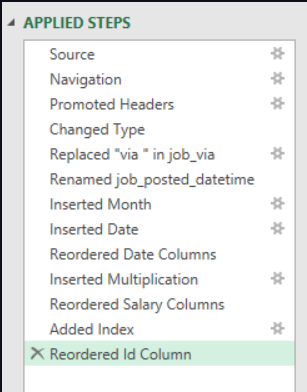

# Data Job Market Analysis using Excel

An Excel-based data analytics project that explores salary trends, in-demand skills, and regional opportunities in the 2023 data job market using real-world job posting data.

---

## About the Project

As a job seeker preparing for a career in data analytics and AI, I wanted to understand what employers actually look for in data professionals. Instead of relying on assumptions, I analyzed a real-world dataset of data-related job postings to identify which skills are most valuable, how salaries differ across roles and regions, and whether building a broader skill set leads to better-paying opportunities.

This project demonstrates how Excel can be used as a complete data analytics tool by combining **Power Query, Power Pivot, PivotTables, DAX, and interactive visualizations** to transform raw data into meaningful business insights.

---

## Project Objectives

This analysis answers the following questions:

- Does having more technical skills lead to higher salaries?
- How do salaries vary across different countries and regions?
- Which technical skills are most commonly requested in data jobs?
- Which skills offer the highest salary potential?

---

## Dataset

The dataset contains real-world data science and analytics job postings from **2023**, including information such as:

- Job titles
- Average annual salaries
- Job locations
- Required technical skills
- Country of employment

---

## Tools & Excel Skills Used

| Skill | Purpose |
|-------|----------|
| Power Query | Data extraction, cleaning, and transformation (ETL) |
| PivotTables | Data summarization and analysis |
| Power Pivot | Creating relationships between multiple tables |
| DAX | Building calculated measures such as median salary |
| Pivot Charts | Visualizing salary and skill trends |

---

# Project Workflow

## 1. Data Preparation (ETL with Power Query)

The first step was preparing the dataset for analysis. Using **Power Query**, I:

- Imported the raw Excel dataset.
- Split the data into separate job and skills tables.
- Cleaned inconsistent text and removed unnecessary columns.
- Corrected data types for accurate analysis.
- Loaded the transformed tables into Excel for further modeling.

### Power Query Transformation



---

## 2. Building the Data Model

To analyze jobs and skills together, I created a **relational data model** using **Power Pivot**.

The two tables were connected using the `job_id` field, allowing skills to be linked with each individual job posting.

### Data Model

> **Insert Image Here**

<!--  -->

---

# Analysis & Insights

## 1. Do More Skills Lead to Better Pay?

I compared the number of skills required for different job roles with their median salaries.

### Key Findings

- Jobs requiring a broader technical skill set generally offer higher salaries.
- Senior Data Engineer and Data Scientist roles showed the strongest relationship between skill count and salary.
- Business Analyst roles typically required fewer technical skills and had lower median salaries.

### Visualization


### Takeaway

Developing multiple complementary technical skills can significantly improve opportunities for higher-paying data roles.

---

## 2. Salary Comparison Across Regions

Using **PivotTables** and **DAX**, I compared median salaries between jobs in the **United States** and jobs in other countries.

### DAX Measure Used

```DAX
Median Salary :=
MEDIAN(data_jobs_all[salary_year_avg])
```

### Key Findings

- US-based data jobs consistently offered higher median salaries.
- Senior-level technical roles had the largest salary gap between US and international markets.
- Demand for experienced data professionals remains strong globally.

### Visualization

> **Insert Chart Here**

<!--  -->

### Takeaway

Location plays an important role in salary expectations, especially for highly specialized technical positions.

---

## 3. Most In-Demand Skills

I analyzed thousands of job postings to identify the skills employers request most frequently.

### Top Skills Identified

| Skill | Industry Demand |
|-------|----------------|
| SQL | Very High |
| Python | Very High |
| Excel | High |
| AWS | High |
| Azure | High |
| Tableau | High |

### Visualization

> **Insert Chart Here**

<!--  -->

### Key Findings

- SQL and Python are the two most frequently requested technical skills.
- Cloud platforms such as AWS and Azure continue to grow in demand.
- Data visualization tools remain essential across analytics roles.

---

## 4. Which Skills Offer the Highest Salaries?

Finally, I compared the **10 most common skills** against their corresponding median salaries.

### Visualization

> **Insert Chart Here**

<!--  -->

### Key Findings

- Python, SQL, and Oracle were associated with the highest-paying opportunities.
- General productivity tools such as Microsoft Word and PowerPoint appeared in lower-paying roles.
- Specialized technical skills have a much stronger impact on salary potential.

### Takeaway

Focusing on high-value technical skills provides a stronger return on learning investment for aspiring data professionals.

---

# Project Highlights

- Cleaned and transformed raw job market data using **Power Query**.
- Built a relational data model with **Power Pivot**.
- Created reusable salary calculations using **DAX**.
- Designed PivotTables and PivotCharts to uncover market trends.
- Performed an end-to-end Excel data analysis project using real-world data.

---

# Key Business Insights

| Insight | Impact |
|--------|---------|
| More technical skills often correlate with higher salaries | Encourages continuous skill development |
| US salaries are generally higher than international salaries | Useful for career planning and salary negotiation |
| SQL and Python dominate job requirements | Essential skills for data careers |
| Cloud technologies continue gaining demand | Valuable area for future upskilling |

---

# What I Learned

Through this project, I strengthened my practical Excel data analytics skills, particularly in:

- Cleaning and transforming real-world datasets.
- Building relational data models.
- Writing DAX measures for business analysis.
- Creating professional dashboards and visualizations.
- Extracting actionable insights from large datasets.

More importantly, this project helped me understand the current data job market from the perspective of someone preparing to enter the industry.

---

# Project Structure

```text
Data-Job-Market-Analysis/
│
├── Data/
│   ├── data_jobs_all.xlsx
│   └── data_job_skills.xlsx
│
├── Images/
│   ├── power-query.png
│   ├── data-model.png
│   ├── chart-skills-vs-salary.png
│   ├── chart-regional-salary.png
│   ├── chart-top-skills.png
│   └── chart-top-skills-salary.png
│
├── Data Job Market Analysis.xlsx
└── README.md
```

---

# Conclusion

As someone preparing for a career in data analytics, I wanted to better understand the skills and opportunities shaping today's job market. By analyzing real-world job posting data, I discovered clear relationships between technical skills, salary potential, and regional demand.

This project demonstrates how Excel can be used beyond spreadsheets—as a powerful data analytics platform for cleaning data, building models, performing analysis, and communicating insights through professional visualizations.
